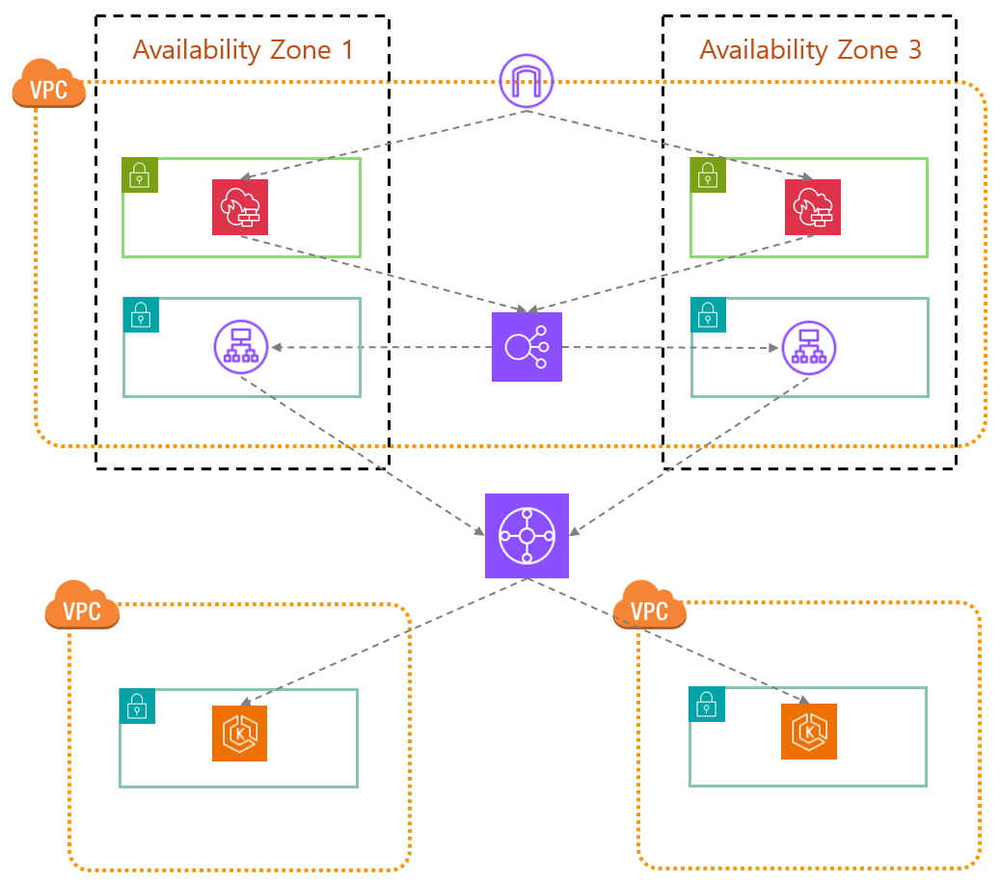

# Terraform AWS Infrastructure

이 프로젝트는 Terraform을 사용하여 AWS 인프라를 프로비저닝합니다.

## Architecture

아래는 이 프로젝트에서 프로비저닝하는 인프라의 아키텍처 다이어그램입니다.



## Security Architecture

이 프로젝트는 Hub & Spoke 모델을 기반으로 한 보안 아키텍처를 가집니다.

외부에서 들어오는 모든 트래픽은 먼저 AWS Network Firewall (NFW)을 통과하여 기본적인 보안 검사를 거칩니다.

그 후, 트래픽은 Application Load Balancer (ALB)로 전달됩니다. ALB는 EKS 클러스터 내의 Ingress Controller를 백엔드로 사용하여 요청을 적절한 서비스로 라우팅합니다.

이 구조는 중앙 집중식 트래픽 필터링과 유연한 서비스 확장을 가능하게 합니다.

## Features

- **VPC**: 사용자 정의 VPC 및 서브넷
- **EC2**: 웹 서버가 설치된 EC2 인스턴스
- **EIP**: EC2 인스턴스용 Elastic IP
- **IGW**: VPC용 인터넷 게이트웨이
- **Route Table**: 인터넷 게이트웨이로 라우팅
- **Security Group**: EC2 인스턴스에 대한 인그레스 및 이그레스 규칙
- **ALB/NLB**: 애플리케이션 및 네트워크 로드 밸런서
- **Target Group**: 로드 밸런서용 대상 그룹
- **EKS**: Amazon EKS 클러스터
- **IAM**: 역할, 정책 및 사용자
- **NAT Gateway**: 프라이빗 서브넷의 아웃바운드 인터넷 액세스
- **Network Firewall**: VPC 트래픽 필터링

## Prerequisites

- [Terraform](https://www.terraform.io/downloads.html)
- [AWS CLI](https://aws.amazon.com/cli/)
- AWS 계정 및 자격 증명 구성

## Usage

1.  리포지토리를 클론합니다.
    ```bash
    git clone https://github.com/your-username/your-repo-name.git
    cd your-repo-name
    ```

2. provider.tf 파일에 있는 key 경로를 개인의 key 경로로 수정합니다.

3.  Terraform을 초기화합니다.
    ```bash
    terraform init
    ```

4.  실행 계획을 생성합니다.
    ```bash
    terraform plan
    ```

5.  인프라를 적용합니다.
    ```bash
    terraform apply
    ```

## Modules

이 프로젝트는 다음과 같은 Terraform 모듈을 사용합니다.

- `EC2`
- `EIP`
- `EKS`
- `IAM_Policy`
- `IAM_Role`
- `IAM_User`
- `IGW`
- `LB`
- `NATGW`
- `NFW`
- `NLB`
- `RouteTable`
- `SG`
- `TargetGroup`
- `VPC`
